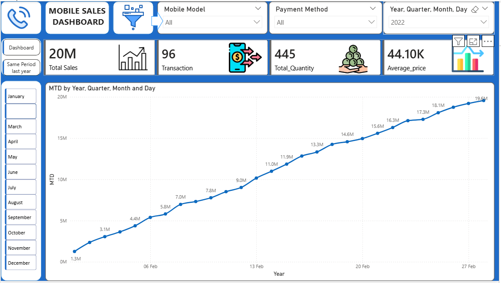
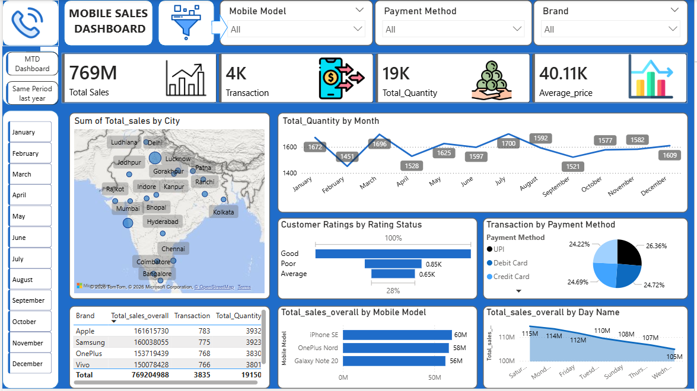

# 📊 Mobile Sales Analysis Dashboard (Power BI)

## 🔹 Brief One-Line Summary
An interactive Power BI dashboard to analyze mobile phone sales performance across time, brands, cities, and payment methods.

---

## 🧩 Overview
This project focuses on analyzing mobile phone sales data to provide clear insights into revenue trends, transaction patterns, customer behavior, and product performance.  
The dashboard is designed for **business users and decision-makers** to quickly understand sales performance and identify growth opportunities.

---

## ❓ Problem Statement
Sales teams often struggle to:
- Track overall and month-to-date (MTD) sales performance
- Compare current sales with the same period last year
- Identify top-performing brands, models, and cities
- Understand customer payment preferences and ratings

This dashboard addresses these problems through **interactive and visual analytics**.

---

## 📁 Dataset
The dataset includes the following key fields:
- Date (Year, Quarter, Month, Day)
- Brand & Mobile Model
- City
- Payment Method
- Quantity Sold
- Sales Amount
- Customer Rating

*(Dataset used for learning and portfolio purposes.)*
---

## 🛠 Tools & Technologies
- Power BI Desktop  
- Power Query (Data Cleaning & Transformation)  
- DAX (Calculated Measures & KPIs)  
- Excel / CSV (Data Source)

---

## ⚙️ Methods
- Data cleaning and transformation using Power Query
- Calendar table creation for time-based analysis
- DAX measures for:
  - Total Sales
  - Total Quantity
  - Average Price
  - MTD Sales
  - Same Period Last Year comparison
- Interactive slicers and cross-filtering

---

## 📊 Dashboard / Output

### 🔹 Overall Sales Dashboard
.png)

### 🔹 MTD (Month-to-Date) Dashboard

### 🔹 Same Period Last Year Comparison

---

## 💡 Key Insights
- Total sales reached **769M**, with consistent growth over time
- Certain brands and models contribute disproportionately to revenue
- UPI and card payments dominate transaction methods
- Sales performance shows clear seasonal and monthly patterns
- Customer ratings help identify satisfaction trends

---

## ▶️ How to Run This Project
1. Download the `.pbix` file from this repository  
2. Open it using **Power BI Desktop**  
3. Use slicers to explore sales by time, brand, city, and payment method  

---

## 📈 Results & Conclusion
The dashboard successfully converts raw sales data into actionable insights, enabling stakeholders to:
- Monitor sales performance efficiently
- Compare historical trends
- Make data-driven business decisions

---

## 🚀 Future Work
- Add customer segmentation analysis
- Include profit and cost metrics
- Automate data refresh
- Add regional-level forecasting

---

## 👤 Author & Contact
**Jahnavi Rai**  
M.Sc. Statistics  
Aspiring Data / Business Analyst  

📧 Email: *raijahnavi2003@gmail.com*  
🔗 LinkedIn: *linkedin.com/in/jahnavi-rai-51a054241*  
